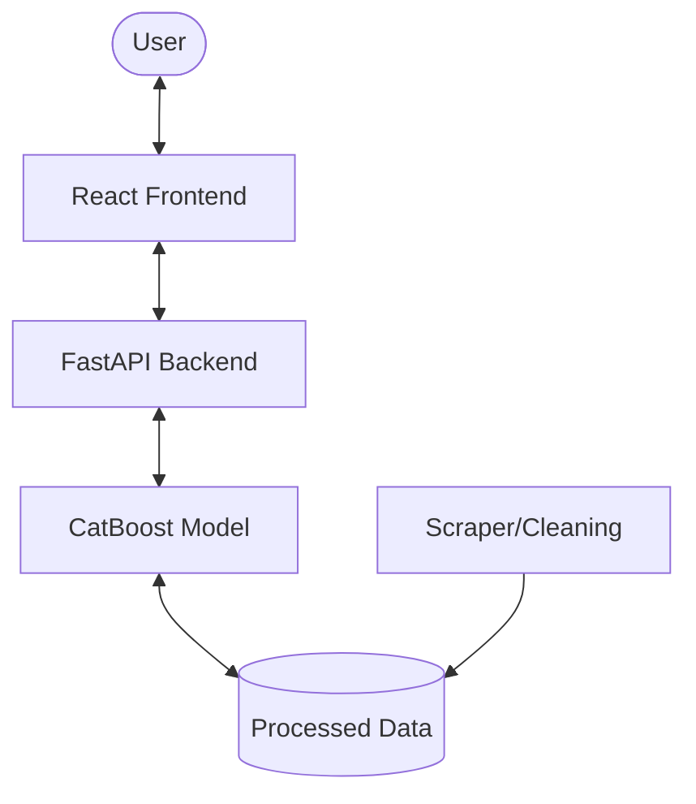

# Job Market Intelligence

An end-to-end platform for job market data collection, analysis, and salary prediction using machine learning.

## Project Demo

<video src="./Recording%202025-12-14%20180127.mp4" controls width="100%"></video>

---

## System Architecture

The system consists of a React frontend, a FastAPI backend, and a CatBoost-based ML pipeline.

- **Frontend**: Built with React and Vite for real-time predictions and data visualization.
- **Backend**: FastAPI serves model inferences and handles data routing.
- **ML Pipeline**: CatBoost Regressor predicts salaries based on role, location, and seniority.
- **Data Layer**: Processes raw job listings into normalized features for training and analysis.

---

## Technical Stack

- **Languages**: Python, JavaScript
- **ML**: CatBoost, Scikit-Learn, Pandas, NumPy
- **Backend**: FastAPI, Uvicorn
- **Frontend**: React, Vite
- **Analysis**: Jupyter Notebooks

---

## Setup Instructions

### Environment
1. Clone the repository: `git clone https://github.com/priyanshsingh11/Job-Market.git`
2. Initialize virtual environment:
   - Windows: `python -m venv .venv; .\.venv\Scripts\Activate.ps1`
   - Unix: `python3 -m venv .venv; source .venv/bin/activate`
3. Install dependencies: `pip install -r requirements.txt`

### Execution
- **Backend**: `uvicorn backend.main:app --reload`
- **Frontend**: `cd frontend; npm install; npm run dev`
- **Analysis**: `jupyter lab` (Navigate to `notebook/`)

---

## Repository Structure

- `backend/`: FastAPI implementation and model serving.
- `frontend/`: React application.
- `model/`: Trained models and serialization.
- `notebook/`: Exploratory Data Analysis and training experiments.
- `src/`: Core logic and data utilities.
- `data/`: Datasets (Raw and Processed).

---

## License
MIT License
Copyright (c) 2025 Priyansh Singh
